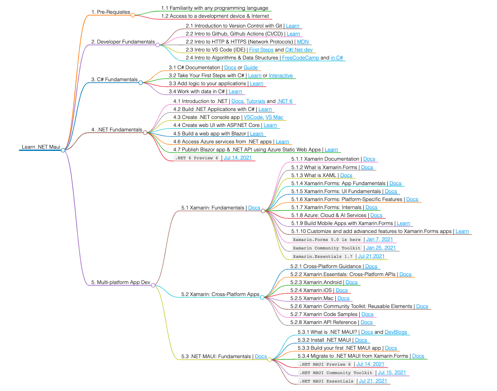

# Developer Roadmap: .NET Multiplatform Dev

| |
|--|
|  | 
|_Image by [ Orfano Mondo/Flickr](https://www.flickr.com/photos/jormakos/3758371104/)_   [Lokelani](https://statesymbolsusa.org/symbol-official-item/hawaii/state-flower/lokelani) is the official flower of the island of Maui. | 
||

## About This Project

It's July 2021. And over the next 12 months, my goal is to explore multi-platform app development (for mobile, web and desktop environments) using a variety of available technologies. This developer (learning) roadmap focuses on the .NET ecosystem.

| | |
|--|--|
| | One of my core targets is [.NET MAUI](https://github.com/dotnet/maui) - currently in [preview 6](https://devblogs.microsoft.com/dotnet/announcing-net-6-preview-6/) - a cross-platform framework for developing mobile (Android, iOS) and desktop (Windows, MacOS) apps using C# and XAML. Read the [docs](https://docs.microsoft.com/en-us/dotnet/maui/what-is-maui) for more details.     This image (from that page) shows the high-level architecture of a .NET MAUI app and how it relates to the .NET framework & device-specific operating systems. |
|  | [Xamarin.Forms](https://docs.microsoft.com/en-us/xamarin/get-started/what-is-xamarin-forms) is an open-source UI framework for building mobile ( Xamarin.Android, Xamarin.iOS) and desktop ( Windows) applications from a shared codebase - using C# and XAML.   Think of it as the precursor to .NET MAUI, with [guidance available](https://docs.microsoft.com/en-us/dotnet/maui/get-started/migrate) to help you migrate existing Xamarin.Forms apps to .NET MAUI  - which will be [generally-available in November 2021](https://github.com/dotnet/maui/wiki/FAQs) when .NET 6 ships |
| | [ASP.NET](https://dotnet.microsoft.com/apps/aspnet) is an open source web framework, created by Microsoft, for [building modern web apps and services with .NET](https://docs.microsoft.com/en-us/dotnet/architecture/modern-web-apps-azure/). ASP.NET allows you to build many types of web applications, including web pages, REST APIs, microservices, and hubs that push real-time content to connected clients. [ASP.NET Core](https://dotnet.microsoft.com/learn/aspnet/what-is-aspnet-core) is the open-source and cross-platform version of [ASP.NET](https://docs.microsoft.com/en-us/aspnet/core/introduction-to-aspnet-core?view=aspnetcore-5.0). The image is from [this 2016 post](https://devblogs.microsoft.com/cesardelatorre/net-core-1-0-net-framework-xamarin-the-whatand-when-to-use-it/) which explains the broader cross-platform strategy in .NET  See [`JUL 2021: ASP.NET Core Updates in .NET 6`](https://devblogs.microsoft.com/aspnet/asp-net-core-updates-in-net-6-preview-6/)|
| | Inspired by [AspNetCore Developer Roadmap](https://github.com/MoienTajik/AspNetCore-Developer-Roadmap) and the [Xamarin Developer Roadmap](https://github.com/Stayrony/Xamarin-Developer-Roadmap) mindmaps, I created one of my own - customized for my learning journey, and prioritizing Docs, Learn and GitHub resources from Microsoft teams. Expect this to change as my learning continues.   You can see the detailed roadmap image [here]() or visit the related [markdown]() for resource links. |
|||

## Learning Objectives
This is the learning objectives with this developer roadmap. I hope you'll join me and create your own! 

 - [ ] Learn C# Fundamentals
 - [ ] Explore C# Development Tools & Technologies
 - [ ] Learn .NET Fundamentals
 - [ ] Explore ASP.NET and Blazor (for web apps)
 - [ ] Explore .NET MAUI (for mobile and desktop apps)
 - [ ] Explore Xamarin.Forms (for awareness and current usage)
 - [ ] Explore .NET Development Tools, Services & Best Practices

