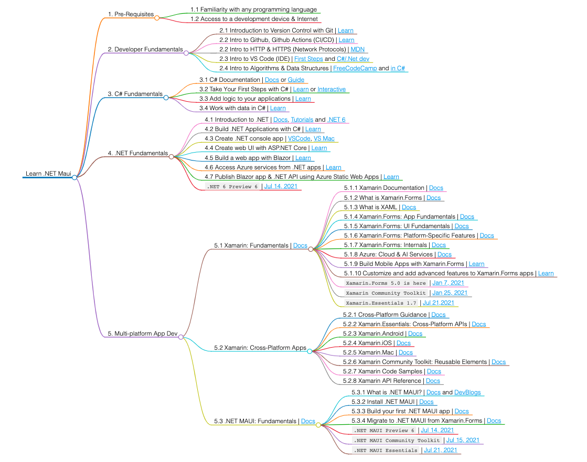

# .NET Multiplatform Apps: Developer Roadmap

This is inspired by the [ASP.NET Core Developer Roadmap](https://github.com/MoienTajik/AspNetCore-Developer-Roadmap) project and adapted for my use. The image below is generated from [this Markdown](/markmap) page, using the [VSCode Markmap extension](https://marketplace.visualstudio.com/items?itemName=gera2ld.markmap-vscode). The roadmap is tentative and likely to be updated over time.

For beginners I suggest these resources and navigational path, to start.
 * [.NET Application Architecture Guide](https://dotnet.microsoft.com/learn/dotnet/architecture-guides) - learn how it all fits together
 * [What is .NET](https://dotnet.microsoft.com/learn/dotnet/what-is-dotnet) - understand the core platform for app dev
 * [Learn C#](https://dotnet.microsoft.com/learn/csharp) - understand the core programming language for .NET
 * [Learn F#](https://dotnet.microsoft.com/learn/fsharp) - a functional programming language for .NET
 * [Learn ASP.NET](https://dotnet.microsoft.com/learn/aspnet) for web development in .NET
 * [Learn Xamarin](https://dotnet.microsoft.com/learn/xamarin) for mobile and desktop app development in .NET
 * [Learn .NET MAUI](https://docs.microsoft.com/en-us/dotnet/maui/) - *new* cross-platform UI toolkit for mobile and desktop apps in .NET

Plus three bonus resources to add that exclamation point to your journey!

 * [Try .NET](https://dotnet.microsoft.com/platform/try-dotnet) - run .NET in your browser (learn or build)
 * [Learn ML.NET](https://dotnet.microsoft.com/learn/ml-dotnet) - add [machine learning to your .NET apps](https://docs.microsoft.com/en-us/dotnet/machine-learning/how-does-mldotnet-work)
 * [Learn .NET Game Development](https://dotnet.microsoft.com/learn/games)
 

